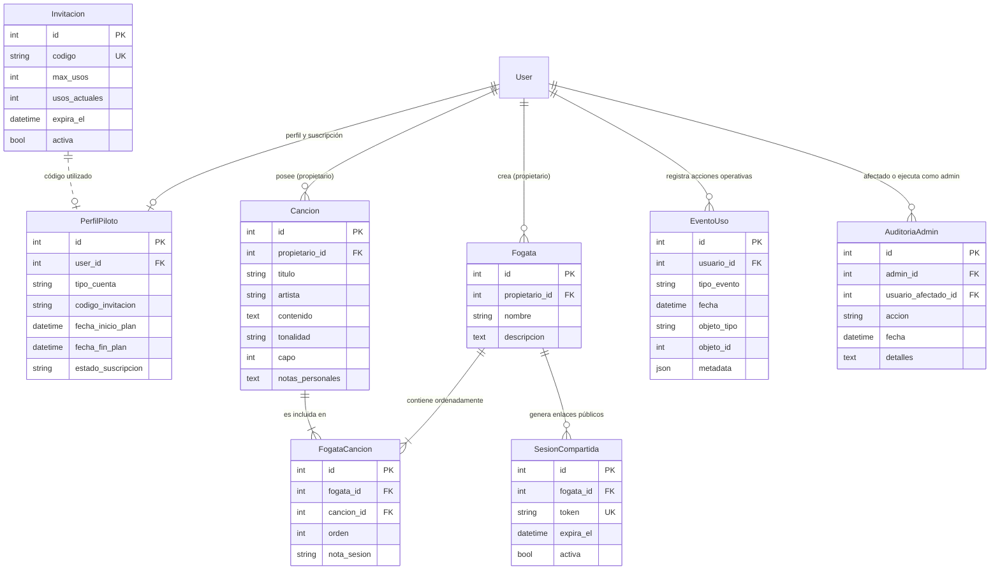

# 🔥 FOGATA — Plataforma Musical y Atril Digital Interactivo

> **El cancionero y atril digital inteligente para músicos en vivo.**  
> Diseñado para tocar en fogatas, ensayos, eventos y escenarios sin distracciones, con preservación espacial milimétrica de acordes, transposición tonal armónica, diagramas interactivos y soporte de repertorios compartidos.

[](https://www.djangoproject.com/)
[](https://www.python.org/)
[-brightgreen?style=flat-square)](#-batería-de-pruebas-y-calidad)
[](#-hoja-de-ruta-y-evolución-por-fases)
[](https://fogata.humm.cl)

---

## 📌 Tabla de Contenidos

1. [Visión y Principios Rectores](#-visión-y-principios-rectores)
2. [Estado Actual del Proyecto](#-estado-actual-del-proyecto)
3. [Hoja de Ruta y Evolución por Fases (Fase 0 a 9)](#-hoja-de-ruta-y-evolución-por-fases)
4. [Arquitectura de Software y Módulos](#-arquitectura-de-software-y-módulos)
5. [Modelo de Datos y Entidades](#-modelo-de-datos-y-entidades)
6. [Motor Musical y Experiencia en Vivo](#-motor-musical-y-experiencia-en-vivo)
7. [Modelo Freemium y Límites Comerciales](#-modelo-freemium-y-límites-comerciales)
8. [Fogata Control Center y Privacidad Estricta](#-fogata-control-center-y-privacidad-estricta)
9. [Instalación y Desarrollo Local](#-instalación-y-desarrollo-local)
10. [Despliegue y Arquitectura en Producción (HostGator)](#-despliegue-y-arquitectura-en-producción-hostgator)
11. [Seguridad, Aislamiento y Concurrencia](#-seguridad-aislamiento-y-concurrencia)
12. [Comandos Frecuentes y Cheat Sheet](#-comandos-frecuentes-y-cheat-sheet)
13. [Documentación Complementaria del Repositorio](#-documentación-complementaria-del-repositorio)

---

## 💡 Visión y Principios Rectores

Fogata nació para resolver las fricciones reales a las que se enfrenta un músico al interpretar canciones en vivo: atriles de papel vulnerables al viento, pantallas de celular que se apagan a mitad de canción, letras descalzadas respecto a los acordes tras copiar/pegar, falta de conectividad en playas o campings, y la imposibilidad de compartir repertorios de forma inmediata con acompañantes o invitados.

El desarrollo de Fogata se rige por cinco principios innegociables:

1. **Fidelidad Espacial Absoluta:** Letras y acordes jamás deben descalzarse ni sufrir saltos de línea imprevistos. Los acordes espaciados se preservan exactamente sobre la sílaba correspondiente.
2. **Capacidad, no Funcionalidad:** La modalidad gratuita (`GRATIS`) permite experimentar el **100% de la experiencia musical** (Modo Tocar, auto-scroll, transposición tonal, diagramas de acordes, links compartidos). La única distinción comercial es de capacidad de almacenamiento (10 canciones y 1 Fogata activa).
3. **Privacidad Estricta de Contenido:** La analítica y telemetría de producto jamás registran letras, acordes, notas de interpretación ni títulos de canciones.
4. **Defensa en Profundidad y Cero IDOR:** Aislamiento multiusuario estricto. Cualquier intento de acceso a recursos de otro usuario o parámetros manipulados responde con un HTTP 404 estricto sin divulgar metadatos ni existencia de entidades.
5. **Rendimiento Nativo sin Dependencias Pesadas:** Renderizado SSR rápido en Django 5.2 LTS, CSS puro/vanilla, JavaScript en ES5 nativo sin frameworks pesados (React/Vue/Webpack), asegurando compatibilidad instantánea en cualquier smartphone o tablet antiguo.

---

## 📊 Estado Actual del Proyecto

| Parámetro | Valor Actual |
| :--- | :--- |
| **Fase Vigente** | **Fase 8 — Modelo Freemium, Planes y Límites** (Completada y aprobada) |
| **Próxima Fase** | **Fase 9 — Medios de Pago e Integración Comercial** (Webpay / Pasarelas) |
| **Suite de Pruebas** | **154 tests automatizados aprobados (100% OK, 0 fallos)** |
| **Entorno de Producción** | Servidor HostGator (`fogata.humm.cl`), Passenger WSGI, HTTPS activo |
| **Base de Datos** | SQLite con configuración atómica y concurrencia protegida (PostgreSQL-ready) |
| **Usuarios del Piloto** | Cuentas activas catalogadas en modalidad `PILOTO` (Pro sin cobro) |

---

## 🗺️ Hoja de Ruta y Evolución por Fases

El desarrollo de Fogata se ha ejecutado de manera incremental a través de fases deliberadas y validadas con informes de auditoría:

```mermaid
flowchart LR
    F0[Fase 0: Cimientos SSR] --> F1[Fase 1: Motor Musical]
    F1 --> F2[Fase 2: Modo Atril]
    F2 --> F3[Fase 3: Transposición]
    F3 --> F4[Fase 4: Diagramas SVG]
    F4 --> F5[Fase 5: Fogatas & PWA]
    F5 --> F6[Fase 6: Multiusuario]
    F6 --> F7[Fase 7: Control Center]
    F7 --> F8[Fase 8: Freemium]
    F8 -.-> F9[Fase 9: Pasarela de Pago]
```



### Detalle de cada fase completada:

* **Fase 0 — Cimientos y Arquitectura:** Base en Django 5.2 LTS, renderizado SSR limpio, configuración de settings desacoplada por variables de entorno y soporte SQLite robusto.
* **Fase 1 — Motor de Ingestión y Preservación Espacial:** Algoritmo en `apps/canciones/parser.py`. Soporte de acordes en formato bracket (`[Sol] [Do]`) y acordes en línea superior con monoespaciado exacto y preservación de sangrías.
* **Fase 2 — Modo Atril / Performance en Vivo:** Vista inmersiva (`/tocar/`) optimizada para lectura a distancia, auto-scroll suave con velocidad dinámica configurable por duración de canción, activación de Wake Lock API (evita que la pantalla se bloquee mientras tocas) y modo nocturno de alto contraste.
* **Fase 3 — Transposición y Notación Musical:** Transposición tonal armónica inteligente de -6 a +6 semitonos respetando escalas y enarmónicos. Conversión instantánea con un clic entre notación anglosajona (`C, D, E...`) y latina (`Do, Re, Mi...`). Editor rápido de acordes con preservación espacial.
* **Fase 4 — Diccionario de Acordes Interactivo:** Motor nativo de generación de diagramas SVG para guitarra en `apps/canciones/diagramas.py` (cero librerías externas pesadas). Panel interactivo desplegable al pulsar cualquier acorde durante la interpretación.
* **Fase 5 — Fogatas, Atril Continuo y Sesiones Compartidas:** Concepto de "Fogata" (setlists ordenados). Navegación fluida canción por canción sin salir de pantalla completa. Sesiones temporales compartidas (`/s/<token>/`) con códigos QR para invitados sin necesidad de registro. Capacidades PWA deliberadas.
* **Fase 6 — Plataforma Multiusuario y Despliegue en Producción:** Autenticación nativa por email normalizado, sistema de invitaciones con consumo atómico para SQLite/Postgres (`Invitacion.consumir_codigo`), aislamiento IDOR absoluto (404 estricto), recuperación de contraseña mediante blind-flow, release gate de 20 controles aprobado y despliegue exitoso en HostGator (`https://fogata.humm.cl`).
* **Fase 7 — Fogata Control Center y Métricas de Uso:** Módulo administrativo en `apps/gestion`. Telemetría de comportamiento sin cookies invasivas y con estricta anonimización. Auditoría inmutable de acciones administrativas (`AuditoriaAdmin`), ficha 360° de usuarios y visualización de cohortes.
* **Fase 8 — Modelo Freemium y Límites de Capacidad:** Servicio centralizado de límites `apps/core/planes.py`. Distinción entre planes `GRATIS` (hasta 10 canciones, 1 Fogata activa, 100% de funciones musicales) y `PRO` (ilimitado). Validación server-side en transacciones atómicas, política de downgrade no destructiva, landing interna `/pro/` ($5.990 semestral / $9.990 anual) y embudo de adopción en Control Center.
* **Fase 9 (Próxima) — Medios de Pago e Integración Comercial:** Integración de checkout formal (Webpay Plus / Mercado Pago / Stripe), procesamiento de webhooks y gestión automatizada del ciclo de vida de suscripciones.

---

## 🏗️ Arquitectura de Software y Módulos

La plataforma está estructurada en 4 aplicaciones Django altamente cohesivas y desacopladas:

```text
FOGATA/
├── apps/
│   ├── core/                  # Autenticación, perfiles, planes freemium, PWA y middleware
│   │   ├── backends.py        # Autenticación por correo normalizado insensible a mayúsculas
│   │   ├── context_processors.py # Inyección global de plan activo en plantillas
│   │   ├── middleware.py      # Control estricto de caché privada (Cache-Control: no-store)
│   │   ├── models.py          # Modelos Invitacion y PerfilPiloto
│   │   ├── planes.py          # Única fuente de verdad de límites, roles y capacidad
│   │   ├── test_planes.py     # Suite de 19 pruebas de planes, límites y concurrencia
│   │   └── views.py           # Login, registro, recuperación de clave, landing /pro/ y PWA
│   │
│   ├── canciones/             # Motor musical, acordes, parser y atril
│   │   ├── diagramas.py       # Generador procedural de diagramas SVG de guitarra
│   │   ├── models.py          # Modelo Cancion (propietario, contenido íntegro, tono, capo)
│   │   ├── parser.py          # Detección de acordes, transposición y renderizado espacial
│   │   ├── tests.py           # Pruebas de ingestión, transposición y modo atril
│   │   └── views.py           # CRUD de canciones y vista inmersiva /tocar/
│   │
│   ├── fogatas/               # Repertorios, setlists y sesiones en vivo
│   │   ├── models.py          # Modelos Fogata, FogataCancion y SesionCompartida
│   │   ├── tests.py           # Pruebas de setlists, tokens seguros y vista compartida
│   │   └── views.py           # Gestión de repertorios, reordenamiento y acceso invitado QR
│   │
│   └── gestion/               # Fogata Control Center (Módulo de administración y analítica)
│       ├── constants.py       # Whitelist estricta de metadatos (política de privacidad)
│       ├── metrics.py         # Cálculo de embudos, métricas de adopción y límites comerciales
│       ├── models.py          # EventoUso y AuditoriaAdmin
│       ├── telemetry.py       # Helper debounce para registro no intrusivo de eventos
│       ├── tests.py           # Pruebas de analítica, embudos y seguridad staff
│       └── views.py           # Dashboard administrativo, usuarios 360 y cambio de plan
│
├── config/                    # Configuración del proyecto Django (settings, urls, wsgi)
├── templates/                 # Plantillas HTML semánticas SSR con herencia desde base.html
├── static/                    # Archivos estáticos (CSS vanilla, fogata.js, service worker)
├── db_backups/                # Copias de seguridad locales y de contingencia
├── .github/workflows/         # Pipeline CI/CD automatizado hacia HostGator
├── deploy.sh                  # Script de despliegue manual por SSH
└── requirements.txt           # Dependencias mínimas y controladas
```

---

## 🗄️ Modelo de Datos y Entidades



---

## 🎸 Motor Musical y Experiencia en Vivo

### 1. Ingestión y Preservación de Acordes (`apps/canciones/parser.py`)
* Soporta dos formatos estándar:
  * **Formato Bracket:** Acordes insertados entre corchetes dentro de la letra (ej: `En el [Sol]muelle de San [Re]Blas`).
  * **Línea Superior:** Líneas de acordes posicionadas directamente encima de las líneas de texto mediante espacios calculados.
* El algoritmo separa tokens de acordes reconocidos contra una gramática armónica formal, evitando falsos positivos con palabras del español (`A`, `Y`, `Si`, `Re`).

### 2. Transposición Armónica Inteligente
* Algoritmo de cálculo por semitonos en el rango `-6` a `+6`.
* Manejo automático de enarmónicos según la tonalidad de destino (ej: `C#` vs `Db`).
* Alternancia dinámica entre **Notación Anglosajona** (`C, D, E, F, G, A, B`) y **Notación Latina** (`Do, Re, Mi, Fa, Sol, La, Si`).

### 3. Diagramas de Acordes para Guitarra (`apps/canciones/diagramas.py`)
* Generación procedural y ligera de diagramas en formato **SVG interactivo**.
* Representación gráfica de los 6 trastes, cuerdas al aire (`O`), cuerdas muteadas (`X`) y posición de cejillos con indicación de traste base.
* Diccionario enriquecido con acordes mayores, menores, séptimas, suspendidos, aumentados, disminuidos y novenas.

### 4. Modo Atril / Performance (`/tocar/`)
* **Pantalla Completa Inmersiva:** Oculta encabezados, barras de navegación y distracciones.
* **Auto-Scroll Suave:** Movimiento continuo del texto ajustable con botones `+` / `-`, barra de progreso y pausa/reanudación inmediata con un toque.
* **Cálculo Automático por Duración:** Posibilidad de ajustar la velocidad según la duración en minutos de la canción.
* **Wake Lock API Integrado:** Previene activamente que el dispositivo apague la pantalla o entre en suspensión durante la interpretación musical.
* **Control de Tipografía y Contraste:** Ajuste del tamaño de letra al vuelo para facilitar lectura a 1 o 2 metros de distancia del atril.

---

## 💎 Modelo Freemium y Límites Comerciales

Implementado en la **Fase 8** bajo el servicio central `apps/core/planes.py`:

| Característica | Fogata Gratis | Fogata Pro | Cuentas Piloto / Admin |
| :--- | :---: | :---: | :---: |
| **Canciones Almacenadas** | Hasta 10 canciones | **Ilimitadas (∞)** | **Ilimitadas (∞)** |
| **Fogatas Activas Simultáneas** | 1 Fogata *(editable indefinidamente)* | **Ilimitadas (∞)** | **Ilimitadas (∞)** |
| **Modo Tocar & Auto-scroll** | ✅ 100% disponible | ✅ 100% disponible | ✅ 100% disponible |
| **Transposición y C ↔ Do** | ✅ 100% disponible | ✅ 100% disponible | ✅ 100% disponible |
| **Diagramas de Acordes** | ✅ 100% disponible | ✅ 100% disponible | ✅ 100% disponible |
| **Sesiones Compartidas & QR** | ✅ 100% disponible | ✅ 100% disponible | ✅ 100% disponible |
| **Precios de Referencia** | $0 para siempre | **$5.990** / semestre<br>**$9.990** / año | Cuentas especiales |

### Reglas Críticas del Modelo:
* **Defensa Server-Side:** La creación de canciones y fogatas valida el cupo dentro de transacciones atómicas `with transaction.atomic():`. Las peticiones manuales POST fabricadas que intenten vulnerar el límite son rechazadas amigablemente.
* **Política de Downgrade No Destructiva:** Si una cuenta Pro vuelve a plan Gratis teniendo 25 canciones y 3 Fogatas, **ningún dato se borra ni se bloquea**. El usuario puede seguir viéndolas, tocándolas, editándolas y compartiéndolas; únicamente no podrá crear canciones nuevas hasta situarse por debajo del límite o reactivar su plan.
* **Experiencia de Usuario Empática:** Sin mensajes punitivos ni lenguaje comercial agresivo. Banners preventivos al alcanzar 8 o 9 canciones e interfaces informativas en `templates/canciones/limite_alcanzado.html` y `templates/fogatas/limite_alcanzado.html`.

---

## 🛡️ Fogata Control Center y Privacidad Estricta

El módulo `apps/gestion` proporciona a los administradores un panel de control operativo sin comprometer la intimidad de los músicos:

```text
[Panel Principal /gestion/]
├── Métricas de Adopción (Usuarios registrados, activados, activos en 7d y 30d)
├── Embudo Comercial Freemium (Registro → Activado → 8+ canciones → Límite → Vio Pro → PRO)
├── Monitor de Capacidad (Usuarios en 8-9 canciones, límite de 10 canciones, límite de Fogatas)
├── Ficha 360° de Usuario (/gestion/usuarios/<id>/)
│   ├── Capacidad activa (ej: 8/10 canciones, 1/1 Fogatas)
│   ├── Historial de eventos y última sesión
│   └── Cambio Manual de Plan (GRATIS ↔ PRO) con Auditoría Inmutable
└── Registro Inmutable de Auditoría (/gestion/auditoria/)
```

### Garantía Ética de Privacidad
En cumplimiento con la política de telemetría de la Fase 7 y 8 (`apps/gestion/constants.py`):
* Se aplica una lista blanca estricta (`METADATA_WHITELIST`) para los eventos de uso.
* **Bajo ninguna circunstancia** se persisten títulos de canciones, fragmentos de letras, progresiones de acordes ni notas personales.

---

## 💻 Instalación y Desarrollo Local

### Prerrequisitos
* Python 3.12 o superior.
* Gestor de paquetes `uv` (recomendado) o `pip`.
* Git.

### Paso a paso

1. **Clonar el repositorio:**
   ```bash
   git clone git@github.com:nativoaustral-bit/fogata.git
   cd fogata
   ```

2. **Crear y activar el entorno virtual:**
   ```bash
   python3 -m venv .venv
   source .venv/bin/activate
   ```

3. **Instalar dependencias:**
   ```bash
   pip install -r requirements.txt
   # O alternativamente con uv:
   # uv pip install -r requirements.txt
   ```

4. **Variables de entorno locales:**
   Crear un archivo `.env` en la raíz del proyecto (opcional en desarrollo, ya que `settings.py` cuenta con defaults seguros para modo local):
   ```env
   DJANGO_DEBUG=True
   DJANGO_SECRET_KEY=clave-local-de-desarrollo-fogata
   DJANGO_ALLOWED_HOSTS=*
   ```

5. **Aplicar migraciones:**
   ```bash
   python manage.py migrate
   ```

6. **Crear superusuario (Administrador):**
   ```bash
   python manage.py createsuperuser
   ```

7. **Ejecutar la suite completa de pruebas:**
   ```bash
   python manage.py test
   ```

8. **Iniciar el servidor de desarrollo:**
   ```bash
   python manage.py runserver
   ```
   Acceder desde el navegador a `http://127.0.0.1:8000/`.

---

## 🚀 Despliegue y Arquitectura en Producción (HostGator)

Fogata se encuentra desplegada en producción en el dominio autoritativo **[https://fogata.humm.cl](https://fogata.humm.cl)** bajo el servidor compartido HostGator (`shared16 / humm.cl`).

### Arquitectura de Aislamiento en el Servidor

Siguiendo el estándar de seguridad de Humm, el código, el entorno virtual, la base de datos persistente y los secretos residen **estrictamente fuera** del árbol web público (`public_html`):

```text
/home1/paulocis/
│
├── apps/
│   └── fogata/
│       ├── app/                     <- Código fuente de la app sincronizado vía Git
│       │   ├── staticfiles/         <- Salida de collectstatic procesada
│       │   └── manage.py
│       ├── venv/                    <- Entorno virtual Python 3.12 aislado (gestionado con uv)
│       ├── var/
│       │   └── db.sqlite3           <- Base de datos persistente (chmod 600, carpeta 700)
│       ├── logs/                    <- Logs de ejecución
│       └── secrets/
│           ├── .env                 <- Variables de entorno de producción (chmod 600)
│           └── admin_creds.txt      <- Credenciales de control (chmod 600)
│
├── fogata.humm.cl/                  <- DocumentRoot público exclusivo del subdominio
│   ├── .htaccess                    <- Forzado HTTPS 301 y bloqueo perimetral de archivos
│   ├── passenger_wsgi.py            <- Punto de entrada Phusion Passenger
│   ├── static -> /home1/paulocis/apps/fogata/app/staticfiles
│   └── tmp/
│       └── restart.txt              <- Archivo para recargar el proceso Passenger
│
└── public_html/                     <- Sitio principal humm.cl (TOTALMENTE AISLADO E INTACTO)
```

### Pipeline de Despliegue Continuo (CI/CD)

El repositorio cuenta con un flujo automatizado en `.github/workflows/deploy.yml`:
1. Cada push a la rama `main` ejecuta una conexión SSH segura autenticada mediante llave Ed25519.
2. El servidor ejecuta `git pull --ff-only origin main`.
3. Se actualizan dependencias mediante `uv pip install -r requirements.txt`.
4. Se ejecutan migraciones (`migrate`) y recolección de estáticos (`collectstatic`).
5. Se ejecuta `touch tmp/restart.txt` para recargar el worker de Phusion Passenger.
6. Se realiza un smoke-test HTTP validando que `https://fogata.humm.cl/` responda código `200 OK`.

### Despliegue Manual de Contingencia
Si se requiere ejecutar un despliegue directo desde la estación de trabajo:
```bash
./deploy.sh
```

---

## 🔒 Seguridad, Aislamiento y Concurrencia

1. **Aislamiento Multiusuario Estricto:**
   * Las consultas ORM filtran invariablemente por `propietario=request.user`.
   * El acceso a canciones o fogatas inexistentes o pertenecientes a terceros devuelve un **HTTP 404 estricto** (`get_object_or_404(Cancion, pk=pk, propietario=request.user)`), evitando que un atacante determine la existencia de identificadores ajenos.
2. **Mitigación de Concurrencia en SQLite:**
   * Dado que SQLite realiza bloqueos a nivel de base de datos y no de fila (`select_for_update` es no-op), el consumo de invitaciones utiliza un `UPDATE` condicional atómico con expresiones `F()`:
     ```python
     Invitacion.objects.filter(
         Q(codigo=codigo, activa=True) &
         (Q(expira_el__isnull=True) | Q(expira_el__gt=ahora)) &
         (Q(max_usos__isnull=True) | Q(usos_actuales__lt=models.F('max_usos')))
     ).update(usos_actuales=models.F('usos_actuales') + 1)
     ```
   * En `settings.py`, la base de datos tiene configurado un `timeout=20` para absorber contenciones milimétricas sin colapsar.
3. **Seguridad Web en Producción (`DEBUG=False`):**
   * `SESSION_COOKIE_SECURE = True`
   * `CSRF_COOKIE_SECURE = True`
   * `SESSION_COOKIE_HTTPONLY = True`
   * `SECURE_CONTENT_TYPE_NOSNIFF = True`
   * `X_FRAME_OPTIONS = 'DENY'`
   * Cabeceras de no-caché en vistas privadas (`PrivateCacheMiddleware`).
4. **Flujo Ciego de Recuperación de Clave:**
   * `FogataPasswordResetView` responde con la misma pantalla genérica independientemente de si el correo existe o no en la plataforma, previniendo enumeración de usuarios.

---

## 🛠️ Comandos Frecuentes y Cheat Sheet

```bash
# Activar entorno virtual
source .venv/bin/activate

# Ejecutar todas las pruebas unitarias e integración (154 tests)
python manage.py test

# Ejecutar únicamente las pruebas del motor de planes y freemium
python manage.py test apps.core.test_planes

# Ejecutar las pruebas del módulo musical y atril
python manage.py test apps.canciones

# Ejecutar las pruebas de gestión y analítica
python manage.py test apps.gestion

# Chequeo sintáctico de JavaScript cliente
node -c static/js/fogata.js
node -c static/js/sw.js

# Verificación de integridad Django
python manage.py check --deploy

# Crear una invitación para el piloto desde la consola de Django
python manage.py shell -c "
from apps.core.models import Invitacion
inv = Invitacion.objects.create(codigo='BETA-FOGATA', descripcion='Músico Invitado', max_usos=1)
print(f'Invitación creada: {inv}')
"

# Recolectar archivos estáticos para producción
python manage.py collectstatic --noinput
```

---

## 📚 Documentación Complementaria del Repositorio

Para profundizar en auditorías técnicas y registros específicos de cada fase, consultar los siguientes documentos disponibles en la raíz del proyecto:

* [DEPLOY_FOGATA_HOSTGATOR.md](file:///Users/rmerinog/PLATAFORMAS/FOGATA/DEPLOY_FOGATA_HOSTGATOR.md): Manual técnico y topología completa del servidor en HostGator.
* [FOGATA_RELEASE_GATE_MULTIUSUARIO.md](file:///Users/rmerinog/PLATAFORMAS/FOGATA/FOGATA_RELEASE_GATE_MULTIUSUARIO.md): Matriz de 20 controles de seguridad adversarial y pentesting de aislamiento.
* [INFORME_IMPLEMENTACION_FASE_8.md](file:///Users/rmerinog/PLATAFORMAS/FOGATA/INFORME_IMPLEMENTACION_FASE_8.md): Informe detallado de arquitectura del modelo Freemium y límites de capacidad.
* [INFORME_IMPLEMENTACION_FASE_7.md](file:///Users/rmerinog/PLATAFORMAS/FOGATA/INFORME_IMPLEMENTACION_FASE_7.md): Especificación del Control Center, privacidad estricta y analítica de producto.
* [INFORME_IMPLEMENTACION_FASE_6.md](file:///Users/rmerinog/PLATAFORMAS/FOGATA/INFORME_IMPLEMENTACION_FASE_6.md): Implementación multiusuario, sistema de invitaciones y despliegue inicial.
* [INFORME_IMPLEMENTACION_FASE_5.md](file:///Users/rmerinog/PLATAFORMAS/FOGATA/INFORME_IMPLEMENTACION_FASE_5.md): Setlists de Fogatas, enlaces temporales con QR y modo atril continuo.
* [INFORME_IMPLEMENTACION_FASE_4.md](file:///Users/rmerinog/PLATAFORMAS/FOGATA/INFORME_IMPLEMENTACION_FASE_4.md): Motor procedural de diagramas de acordes SVG para guitarra.
* [INFORME_IMPLEMENTACION_FASE_3.md](file:///Users/rmerinog/PLATAFORMAS/FOGATA/INFORME_IMPLEMENTACION_FASE_3.md): Transposición armónica y alternancia de notación C ↔ Do.
* [INFORME_IMPLEMENTACION_FASE_2.md](file:///Users/rmerinog/PLATAFORMAS/FOGATA/INFORME_IMPLEMENTACION_FASE_2.md): Modo Atril, auto-scroll y Wake Lock API.
* [PILOTO_EXTERNO_FOGATA.md](file:///Users/rmerinog/PLATAFORMAS/FOGATA/PILOTO_EXTERNO_FOGATA.md): Guía de acompañamiento y protocolo para los primeros músicos del piloto.

---

*Fogata es un producto desarrollado con dedicación por el equipo de Humm.*  
*Contacto de soporte técnico y administración: [fogata.humm.cl](https://fogata.humm.cl)*
